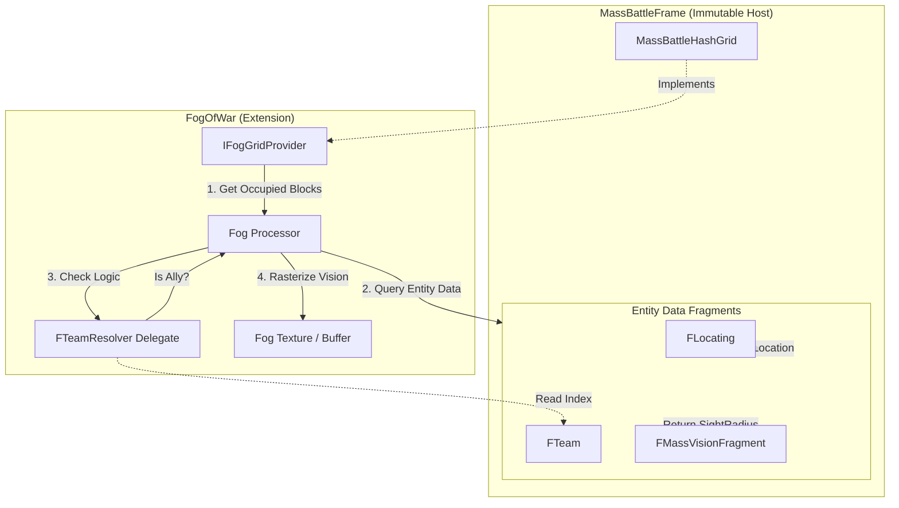

# Winyunq FogOfWar High-Performance Architecture

本项目是专为 **MassBattleFrame** 设计的高性能战争迷雾解决方案。它利用 Mass Entity System (ECS) 的数据驱动特性和 Sparse Hash Grid（稀疏哈希网格）技术，旨在支持 4096*4096 甚至更大的超大规模地图。

## 1. 核心架构设计

### 1.1 MassBattle 核心组件集成 (Core MassBattle Integration)

本插件的设计哲学是 **"Follower Architecture" (跟随者架构)**。我们不创造新的世界真理，而是从 MassBattle 中读取真理。以下是 FogOfWar 深度依赖的 MassBattle 核心组件及其数据定义：

1.  **位置源 (Position Source) - `FLocating`**
    *   **定义**: `Fragments/Transform.h`
    *   **C++ 结构**:
        ```cpp
        USTRUCT(BlueprintType)
        struct MASSBATTLE_API FLocating : public FA_MassBattleBaseFragment
        {
            GENERATED_BODY()
            // Units location. This is the TRUTH we read.
            UPROPERTY(...)
            FVector Location = FVector::ZeroVector; 
            ...
        };
        ```
    *   **作用**: FogOfWar 每一帧读取此 `Location` 来计算单位在 World Partition Grid 中的索引。

2.  **阵营源 (Faction Source) - `FTeam`**
    *   **定义**: `Fragments/Team.h`
    *   **C++ 结构**: `struct FTeam { int32 index; }`
    *   **自定义关系 (Relationship Strategy)**:
        *   我们**不硬编码** `TeamA == TeamB`。
        *   **解决方案**: FogOfWar 将暴露一个 **可绑定的静态委托 (Static Delegate)** 或 **宏 (Macro)** 接口：
            ```cpp
            // FTeamRelationshipResolver::IsAlly(int32 ObserverTeam, int32 TargetTeam)
            // 默认实现: return ObserverTeam == TargetTeam;
            // 用户重写: return (ObserverTeam & TargetTeam) != 0; // 举例：位运算同盟
            ```
        *   这允许用户用任意逻辑（位掩码、查表、异或）来定义“谁能共享视野”。

3.  **核心数据源 (Core Data Source) - Spatial Hashing**
    *   **定义**: `MassBattleHashGridSubsystem`
    *   **机制**:
        *   这也是我们的**唯一真理来源**。FogOfWar **不会**去遍历 `FMassEntityManager` 中的 Entity 列表（那太慢了）。
        *   **Spatial Hashing**: MassBattle 将无限的世界切分为 `300cm x 300cm` 的 `Cell`，每 `16x16x16` 个 Cell 组成一个 `Block`。
        *   **Sparse Iteration (稀疏遍历)**:
            *   对于小地图 (Minimap) 和迷雾，我们需要的数据就在 `FHashGridAgentCell` 中。
            *   **极速访问**: 我们只需要遍历玩家视野覆盖的那些 Block (约 16x16 = 256 个 Block)，就能获取所有相关单位的信息。
            *   **直接访问**: 通过 `MassBattleHashGrid->GetAgentCellAt(Coord)`，我们可以直接拿到紧凑排列的单位数组，这是 CPU 缓存极其友好的。

### 1.2 核心流程 (Core Process Flow)

既然 `MassBattleFrame` 是不可修改的宿主 (Immutable Host)，我们的插件是一个增强模块。以下流程图展示了 `FogProcessor` 如何从 MassBattle 中**提取**所需数据并**处理**成迷雾。



### 1.2 核心理念: 强依赖与直接调用 (Direct Dependency)

**拒绝中间层，拒绝数据同步。**

*   **现状**: `MassBattleFrame` 已经拥有完美空间索引的 `MassBattleHashGrid`。
*   **错误做法**: 创建一个 `FogIntegration` 层，把 Mass 的数据 Copy 一份传给 Fog。
*   **正确做法**: `FogOfWar` **强依赖** `MassBattle`。
    *   **Direct Call**: 迷雾系统直接调用 `MassBattleHashGridSubsystem->GetAgentGrid()`。
    *   **Zero Copy**: 不需要维护任何“迷雾单位列表”。数据源永远只有一个：`MassBattleHashGrid`。

#### 1.3.1 输入接口 (Input API)
*   **显式启动**: `UFogOfWarSubsystem::Get(World)->StartFogOfWar(Config)`
*   **配置**: 传入 `UFogOfWarConfig` 或直接使用 MassBattle 的配置。

### 1.3 核心战略: 剥削 MassBlock (Exploiting Mass Structure)

这不再是一个“移植”问题，而是一个 **“挂载”** 问题。我们将迷雾计算 **挂载** 在 `MassBattleHashGrid` 的既有结构上。

#### 1.3.1 既有结构 (The Existing Structure)
`MassBattleHashGrid` 已经在内存中维护了 **16x16x16** 的 `Block` 结构 (LOD2)。
*   这是事实标准，不需要我们重新划分。
*   内存中已有 `TMap<FIntVector, TSharedPtr<FAgentGridBlock>> AgentGrid`。

#### 1.3.2 直接访问 (Direct Access Strategy)
*   **小地图更新**:
    1.  `FogOfWar` 想要更新某个区域？直接计算出对应的 `Block Coordinate`。
    2.  直接指针访问: `MassBattleHashGrid->AgentGrid.Find(BlockCoord)`。
    3.  **如果指针为空**: 证明该区域无单位，直接跳过 (Cost = 0)。
    4.  **如果指针存在**: 直接遍历 Block 内的 `Cells` 获取视野半径。

#### 1.3.3 真正的零开销 (True Zero Overhead)
*   我们不创建新网格。
*   我们不复制单位数据。
*   我们甚至不遍历 Entity Array，而是直接读 HashGrid 的内存热区。


#### 1.3.3 输出接口 (Output Usage)
(输出到材质部分的逻辑保持不变，材质依然采样这张通过差分同步更新的 Texture)
```hlsl
// HLSL 采样逻辑同上...
```

### 1.4 深度集成 (Deep Integration)

为了贯彻 "如无必要，勿增实体" 的原则，我们将直接利用 MassBattle 的现有资产：
...

## 2. 数据流 (Data Flow)

### 2.1 架构概览 (Architecture Overview)

为了让您对各个类及其职责一目了然，我们整理了以下架构表：

| Class (类名)                    | Function (函数/职责)                              | File Location (文件路径) | Description (说明)                                             |
| :------------------------------ | :------------------------------------------------ | :----------------------- | :------------------------------------------------------------- |
| **AFogOfWar**                   | `UpdateVisibilities`<br>`ResetCachedVisibilities` | `Core/`                  | **真理管理者**。执行核心 DDA 算法，维护全局 `FTile` 计数网格。 |
| **UVisionProcessor**            | `Execute`                                         | `Processors/`            | **Mass 驱动器**。监听位置变化，驱动增量更新逻辑。              |
| **MinimapDataSubsystem**        | `UpdateVisionGrid`                                | `Integration/`           | **数据中转**。存储小地图图层数据，管理坐标转换。               |
| **FMassVisionFragment**         | N/A (Data)                                        | `Fragments/`             | **配置数据**。存储单位视野半径、颜色等。                       |
| **FMassPreviousVisionFragment** | N/A (Cache)                                       | `Fragments/`             | **局部更新缓存**。存储上一帧视野状态，用于“擦除”旧视野。       |

### 2.2 目录结构 (File Structure)

基于 Winyunq 风格与分层解耦原则，我们将插件源码划分为以下核心模块：

```text
Plugins/FogOfWar/Source/FogOfWar/
├── Core/           # 真理层：AFogOfWar, DDA算法。核心可见性计算。
├── Processors/     # 驱动层：MassFogOfWarProcessors。监听 Mass 移动并驱动更新。
├── Fragments/      # 数据层：MassFogOfWarFragments。定义视野与缓存组件。
├── Integration/    # 桥接层：MinimapDataSubsystem。中转 2D 数据供 UI 消费。
├── UI/             # 合成层：MinimapWidget。利用材质进行多层“交并”显示。
└── Utils/          # 工具层：网格映射、坐标转换原子逻辑。
```

### 2.3 初始化阶段 (Initialization)
1.  **配置**: 开发者在 `MassAgentConfig` 中为实体添加 `FMassVisionFragment`。
2.  **生成**: Mass 自动注入 `FMassPreviousVisionFragment` 作为增量更新的缓存。
3.  **激活**: 通过 `StartFogOfWar` 初始化全局 `AFogOfWar` 管理器。

### 2.4 运行时更新 (Runtime Update)

1.  **游戏迷雾 (High Frequency)**: 相机移动 -> 查询 `HashGrid` 周边 Block -> 更新材质参数 (Viewport Rect)。
2.  **小地图 (Low Frequency)**: 定时器/事件驱动 -> 遍历 256 个缓存 Block -> 多线程 DDA 更新 FTile 网格 -> 写入小地图纹理。


## 3. 性能目标 (Performance Goals)

*   **内存占用**: 仅随活跃区域线性增长，而非随地图尺寸平方增长。
*   **CPU消耗**: 利用 Mass 的多线程 Processor，并行计算每个 Block 的视野更新。
*   **扩展性**: 理论支持无限大地图，仅受限于内存总量。

## 4. 迁移指南 (Migration Guide)

如果您是从旧版 FogOfWar 迁移而来：
*   ❌ **移除**: 不要再给 Actor 添加 `VisionComponent`。
*   ✅ **配置**: 直接在 MassBattle 的 DataAsset 中配置 Vision 属性。
*   ✅ **依赖**: 确保您的 `MassBattleFrame` 插件正确依赖了本插件。
