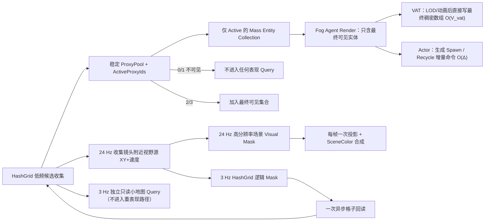

# FogOfWar 2.0 — MassBattleFrame 战争迷雾与 GPU 小地图

## 授权与商业扩展

公开版提供战争迷雾与 GPU 小地图基础能力。利用战争迷雾状态过滤场景单位表现提交、降低大规模单位渲染开销的 **Scene Visibility Performance Extension** 属于商业扩展，不属于本仓库根目录 MIT 授权范围，也不随公开版提供。

如需该扩展的授权版本、适配服务或技术支持，请联系：

**winyunq@gmail.com**

商业扩展的具体授权边界见 [COMMERCIAL_FEATURE_LICENSE.md](COMMERCIAL_FEATURE_LICENSE.md)。未经 Winyunq 书面授权，不得复制、分发、再许可或公开其实现。

本插件不修改 MassBattleFrame 源码。它在 `DefaultMass.ini` 中关闭 MBF 原 Agent Render，并注册同阶段、同优先级、同处理器名称的 FogOfWar 自有实现。替代 Processor 以 HashGrid 低频维护稳定代理池和轻量 `ActiveProxyIds`；VAT/Actor 只处理最终可见实体。

目标只有性能和容量：让 MassBattleFrame 支持更多单位。镜头外和深雾中的单位不进入重表现路径；普通帧的 CPU 遍历、数组写入和后端提交随当前有效工作集增长，而不是随全体单位数或历史实例槽位高水位增长。这不是以画面效果为目标的改造。

硬约束：任何新增过滤步骤都必须在同一条热路径上删除更多、更贵的后续工作；否则不引入。禁止用预热、额外全量遍历、多级中间状态或重复缓存，以更多计算换取所谓的优化。

启用边界只有 Actor 是否存在：没有 `AMassBattleFrameFogOfWar` 时，替代 Processor 立即调用 MassBattleFrame 原版 `Execute`；Actor 一旦进入场景便自动启用裁剪管线，不提供 `bAutoActivate`、运行时关闭或全量回退。HashGrid、遮罩布局、View Extension 或 Processor 所有权不满足时直接报致命配置错误。

## 当前管线


```mermaid
flowchart LR
    A["HashGrid 低频候选收集"] --> B["稳定 ProxyPool + ActiveProxyIds"]
    B --> C["仅 Active 的 Mass Entity Collection"]
    C --> D["Fog Agent Render：只含最终可见实体"]
    D --> E1["VAT：LOD/动画后直接写最终稠密数组 O(V_vat)"]
    D --> E2["Actor：生成 Spawn / Recycle 增量命令 O(Δ)"]
    A --> E["24 Hz 收集镜头附近视野源 XY+速度"]
    E --> F1["24 Hz 高分辨率场景 Visual Mask"]
    E --> F2["3 Hz HashGrid 逻辑 Mask"]
    F1 --> L["每帧一次投影 + SceneColor 合成"]
    F2 --> G["一次异步格子回读"]
    G --> A
    B -->|"0/1 不可见"| H["不进入任何表现 Query"]
    B -->|"2/3"| J["加入最终可见集合"]
    A --> K["3 Hz 独立只读小地图 Query（不进入重表现路径）"]
```

场景显示与单位过滤共用同一份 `24 Hz` 紧凑视野源上传，但使用两张职责不同的 PF_G8 GPU 图：高分辨率 Visual Mask 按 `24 Hz` 用真实源位置和真实半径绘制，只供场景显示；HashGrid 对齐逻辑 Mask 按 `3 Hz` 保守绘制并异步回读，只供单位过滤。两张图不触发第二次 CPU 遍历或第二次源上传；普通渲染帧只把缓存 Visual Mask 投影一次并合成 SceneColor。不存在 Landscape 扫描、Decal/MID/MPC 或 SceneDepth 世界坐标反算。

场景与小地图消费同一份视野状态，但显示强度参数彼此独立；两者默认都为 `0.30`。状态 `3` 在两者中都严格显示原始画面；状态 `0/1/2` 分别使用场景 Actor 与小地图 Widget 自己的 `0.30`，修改任一侧不会覆盖另一侧。

## 状态含义

PF_G8 纹理保存精确字节：

- `0`：深雾。普通单位退出 Active 工作集，不拥有有效 VAT/Actor 提交。
- `1`：异步世界图换区时的保守内部值。与 `0` 相同，不进入 Active 工作集，也不写任何表现后端。
- `2`：仅用于攻击暴露、`AlwaysFogVisible` 与可安全重放的 `RememberLastSeen` 等单单位例外。提交选定表现后端，但不揭开地形。
- `3`：真视野。提交选定表现后端，场景显示原始亮度。

两张 GPU 图都关闭 Blend：圆内片元写同一个值，因此重叠圆天然得到二值 OR，不需要 Max-Blend 或原子合成。Visual Mask 按真实半径写 `0/1`；逻辑 Mask 保持既有真实半径并写 `0/3`。异步回读只读取这张低分辨率逻辑图的精确字节。

面向玩法只暴露三种结果：深雾不可见、单单位雾中可见、真视野。状态 `1` 只防止异步布局交接把未知格误判为可见，不是第四种玩法状态，也不产生预热工作。

## 单位策略

`FMassBattleFogVisionSourceFragment` 是可选的 Archetype 级只读策略，添加到 MassBattle AgentConfig 的 `ExtraData.ConstSharedFragments`。它不是 `FMassVisibilityFragment`，也不保存运行时可见性。

- `bProvidesVision=true`：本地玩家或盟友的该类型可以提供视野。敌方单位永远不会因为这个值揭开地形。
- `Standard`：深雾隐藏；发起攻击时只临时暴露攻击者本身。
- `AlwaysFogVisible`：镜头内始终至少为状态 `2`。它在迷雾中显示为暗色，但不揭开地形或周围单位。
- `RememberLastSeen`：用于建筑。最后一次状态 `3` 时保存位置、朝向、缩放、动画/材质参数、血条、LOD 和样式；失去视野后不得读取建筑后台的实时变化。

`RememberLastSeen` 类型还需把 `FMassBattleFogLastSeenFragment` 添加到 `ExtraData.Fragments`。快照读写发生在替代 Processor 的有效实体执行中，不存在逐帧全量缓存维护 Query。当前冻结快照只由 VAT 后端重放；Actor 类型在失去真视野后隐藏，避免为了画面语义重新引入隐藏实体更新或泄露实时状态。重新获得真视野时直接校正到权威状态。

永久可见、攻击暴露和建筑快照都只把单个单位提升到状态 `2`，不会改写世界状态纹理。小地图在同一个 3 Hz 快照中把这些单位加入“雾中暗标记”批次；真视野单位标记随后以全亮度覆盖同位置暗标记。

## 表现后端提交与稠密帧缓冲

- 镜头候选窗口外：不提交，包括友军；视野源收集与表现提交相互独立，不会形成自锁。
- 深雾状态 `0` 与内部状态 `1`：从 `ActiveProxyIds` 以 swap-remove 移除；VAT 不上传重数组，Actor 只产生必要的回收命令。
- 状态 `2/3`：只提交最终选定的一个后端。VAT 工作量为最终粒子数，Actor 创建/回收按状态变化增量执行。
- `AlwaysFogVisible` 是有意保留的单单位例外；`RememberLastSeen` 仅在 VAT 可安全重放冻结快照时保留。

Fog 不通过增删 Mass Tag 表示可见性。`FRenderingTag`/`FNotRenderingTag` 仍只服从 MBF 原本的 `FVisualize::bEnable`，避免单位过雾边界时触发 Archetype 迁移。

`FVisualizing` 中的 Target/Interp/动画状态保持稳定；`InstanceId` 只是本帧稠密数组位置，不再是永久 Niagara 槽。每帧从 `ActiveProxyIds` 直接写最终数组，`LocationArray.Num()` 跟随本帧有效数量，数组 Capacity 不因普通可见性波动收缩。不存在“先写全体稀疏数组，再压缩重数组”的 Pass。Active handles 使用 UE 5.8 的版本感知 `UE::Mass::FEntityCollection` 缓存：成员稳定时不重写 handle 列表，只有成员变化才替换 handles；Archetype entity-order version 变化时由 UE 自行重建 ranges。VAT 稠密准备每个 Active 代理只查一次 `FVisualizing`，并在本帧复用该指针，不再重复随机读取 Flags/Visualize/Visualizing。

## 场景迷雾

场景显示由相机 Scene View Extension 完成。每个渲染帧只用一个六顶点实例把已经完成的高分辨率 Visual Mask 投影到屏幕 PF_G8 `VisibilityMask`，再用一个全屏 Pass 合成 SceneColor：迷雾区为 `SceneColor * (1 - FogOpacity)`，揭开区保持原始 SceneColor。普通渲染帧的该路径与视野源数量无关。场景默认 `FogOpacity=0.30`，所以两区分别是 `70%` 与 `100%` 原画面亮度。

源位置默认 `24 Hz` 收集并只上传一次；同一次上传以一个 `DrawPrimitive(..., InstanceCount)` GPU 实例化调用把所有真实圆写入场景 Visual Mask。XY 速度只用于该次生成时的有上限预测。普通渲染帧不会重新外推或逐源绘制；无论一个还是一万个源，屏幕投影固定为一个实例。

缓存世界状态图统一投到 `SceneFogProjectionPlaneZ`，不使用提供视野单位自身的 Z。这仍然是平面屏幕投影：高空粒子的屏幕位置与地面 XY 可能存在视差，这是该相机合成方案的已知限制，不是 Landscape 或材质接收问题。

HashGrid 对齐 PF_G8 逻辑图默认 `3 Hz`，只服务表现后端的一次异步回读；一个纹素严格对应一个 `UMassBattleHashGridSubsystem::AgentCellSize` XY 格。`24 Hz` 视野源请求仍使用既有镜头窗口与视野窗口的并集 HashGrid 扫描同时刷新 Active 工作集；3 Hz 逻辑图复用最近一次源 Buffer，不发起第二条 source-only 扫描或 CPU 上传。普通渲染帧与模拟子帧的重表现 Query 都只调度缓存的 Active collection，不遍历全体 Agent。

场景显示完全不扫描 Landscape、不创建 Decal/MID/MPC、不重注册地形组件，也不改任何地图材质。屏幕显示直接消费缓存的高分辨率 Visual Mask，因此没有第二次单位收集、源上传或逐源屏幕 Pass。

## 小地图

小地图默认 `3 Hz`，每 `1/3 s` 请求一次全图紧凑快照。它使用独立的低频只读 Query，只读取激活标记、Team、Location、Visualize 和可选迷雾策略/最后快照；不会让重表现 Query 回退到全量 LOD、VAT、插值和 Niagara 打包。该轻查询写出：

- 友军/盟军实际视野源前缀；
- 全部单位的 `float4(XYZ + Team)` 标记；
- 永久可见和建筑最后快照的雾中暗标记。

攻击事件另追加单单位暗标记，不写视野 stencil。小地图不读取场景裁剪后的 Niagara Batch，因此镜头外的友军视野不会从小地图消失。

## 玩家与盟友

- 本地玩家身份来自 `URTSSelectionSubsystem::GetPlayerTeamIndex()`。
- 盟友来自当前世界 `URTSDiplomacySubsystem::GetSnapshot()`；只合并关系为 `Allied` 的 Team，`Neutral` 不共享视野。
- `AlliedTeamIndices` 保留为手工追加项，不会覆盖外交系统结果。
- 场景与小地图共享同一份玩家/盟友位掩码、统一视野半径和单位类型策略。
- 外交扫描只读取当前玩家的一行小型 Team 关系矩阵；关系修订后在下一次 `24 Hz` 场景配置或 `3 Hz` 小地图配置时生效，不查询也不遍历单位。
- 东亚 `PVE_R_1936` 中 Team `2/3/4/5` 同属 Alliance `100`，因此任意一方作为本地玩家时都会合并其余三方的视野源。

## Processor 接管

`Config/DefaultMass.ini`：

```ini
[/Script/MassBattle.MassBattleAgentRenderProcessor]
bAutoRegisterWithProcessingPhases=False

[/Script/FogOfWar.MassBattleFogAgentRenderProcessor]
bAutoRegisterWithProcessingPhases=True
```

FogOfWar 在 `PostConfigInit` 把 Agent Render 所有权写入当前进程的 Mass 配置缓存，发生在 Processor CDO 和 Phase 列表冻结之前；不会修改 MassBattleFrame 文件。`PostEngineInit` 再审计实际 Phase 列表，并强制要求“原 Agent Render 不存在、Fog Agent Render 存在”；不满足时直接 Fatal，不存在运行时切换、双写或兼容分支。

副本保持 MBF 原来的 `FrameEnd`、Priority `10`、依赖和处理器名称。文件头记录上游 SHA-256；升级 MassBattleFrame 时机械同步副本，再重新应用标记为 `FOG-OF-WAR INSERTION` 的改动。

## 明确禁止

- 普通渲染帧或模拟子帧在表现 Processor 中全量扫描 Mass Agent；
- 普通帧遍历全世界 `AgentGrid.Agents` 或历史 Renderer 槽位；
- 先生成全体 Niagara 数据再二次删除；
- CPU 圆覆盖、CPU 网格膨胀或 CPU 视野集合求解；
- 除既有 VisibilityMask + SceneColor 合成之外再增加屏幕全量管线，或用 SceneDepth 做逐像素世界坐标反算；
- `FMassVisibilityFragment`；
- `VisionMapGrid`、`PreviousVision`；
- 用 Fog 频繁增删 Mass Tag；
- 把攻击者或永久可见单位当作地形视野源。

## 默认值

| 模块 | 默认值 |
| --- | ---: |
| 小地图快照 | `3 Hz` |
| 场景 Visual Mask | `24 Hz`，默认视口分辨率，单轴最高 `2048`、总像素最高 `2,097,152` |
| HashGrid 逻辑 Mask/回读 | `3 Hz` |
| 场景显示 | 每个渲染帧固定 `1` 个缓存状态图投影实例 + `1` 个 SceneColor Composite Pass |
| 场景迷雾强度 | `0.30`（独立显示参数） |
| 小地图迷雾强度 | `0.30`（独立显示参数） |
| Active HashGrid 垂直半高 | `4096 cm`（`DefaultMass.ini` 可调） |
| 空闲 Niagara Batch 最短保温 | `20 s` |
| Landscape/材质额外热路径 | `0`；不绑定 Landscape、Decal、MID 或 MPC |

## 验证

2026-07-21 的当前版本已删除旧 `AFogOfWar` 类、三个旧蓝图资产及动态启用入口，并把 8 个地图实例和 UI 类引用迁移到唯一的 `BP_MassBattleFrameFogOfWar`。完整 UE 5.8 Editor 构建已通过；冷启动日志确认原 Agent Render 缺席、Fog Agent Render 独占对应阶段。该验证证明编译、加载和管线所有权，不代替目标大单位地图的 Insights/GPU 验收。

CSV 分类 `FogMassBattleRender` 暴露 `WorkSetRefresh`、`VisionGather`、`SpatialCandidates`、`FogVisibilityTests`、`FogVisibleCandidates`、`VisionGatherCandidates`、`VisionSources`、`ActiveHandleListRebuilt`、`MinimapSnapshotAgents` 和 `UploadedElements`。一次刷新只能出现一遍融合空间扫描；普通稳定帧 `WorkSetRefresh=0`，成员稳定时 `ActiveHandleListRebuilt=0`，`UploadedElements` 必须跟随最终可见 VAT 数而不是全体单位数。这些计数证明复杂度边界，不能替代目标地图的性能实测。

场景蓝图 CDO 默认 `FogOpacity=0.30`，各关卡 Fog Actor 应继承该值；小地图的 `0.30` 来自独立 Widget 参数。若地图复制自曾经保存过其他数值的 Actor，必须重置场景实例覆盖，否则 C++/蓝图新默认不会覆盖已序列化的旧值。

最终性能结论必须在目标上万单位地图使用 Unreal Insights、`stat GPU` 和 RenderDoc 测量，至少记录总单位数、空间候选数、深雾剔除数、单单位雾中可见例外数、真视野数、最终 Niagara 元素/上传字节、状态纹理尺寸与各 GPU Pass 时间。
